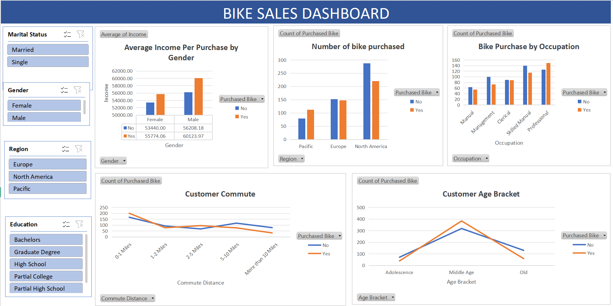

# Bike Sales Excel Dashboard

## Project Overview
This project analyzes bike sales data using Microsoft Excel to identify customer trends, improve business decisions, and drive sales strategies. The analysis involved **data cleaning, customer segmentation, and sales performance visualization**.  

**Objective:** Understand which customers buy bikes, their demographics, and how to improve sales performance.

---

## Tools & Techniques
- **Microsoft Excel** – Data organization, analysis, and visualization  
- **Data Cleaning** – Removed duplicates, fixed inconsistencies, standardized data formats  
- **IF Formulas** – Categorized customers into age groups  
- **Pivot Tables & Pivot Charts** – Summarized sales performance and created interactive dashboards  

---

## Data Analysis & Key Insights

### 1. Income & Purchase Behavior
- Customers who purchased bikes generally have **higher income** than non-buyers.  
- Male customers showed a slightly higher average income per purchase compared to female customers.  

### 2. Regional Sales Performance
- **North America** leads in bike purchases, followed by **Europe** and the **Pacific region**.  
- Europe has a high number of non-purchases, indicating a **potential growth opportunity**.  

### 3. Occupation Trends
- **Professional** and **Skilled Manual workers** are the most frequent buyers.  
- Manual and Clerical workers purchase less frequently.  

### 4. Customer Commute Patterns
- Customers with **short commutes (0–1 mile)** are more likely to purchase bikes.  
- Customers with **longer commutes** buy less frequently.  

### 5. Age Segmentation
- **Middle-aged customers** dominate bike purchases.  
- Adolescents and older adults purchase less frequently.  

---

## Recommendations
- **Target marketing campaigns** at middle-aged customers in North America.  
- **Offer promotions** for short-distance commuters to increase sales.  
- **Explore growth opportunities** in Europe, focusing on converting non-buyers.  
- Use insights to inform **product placement, promotions, and customer engagement strategies**.  

---

## Dashboard
The **Pivot Tables & Charts** sheet contains the interactive dashboard summarizing sales performance, customer segments, and key insights.  

---

## Skills Demonstrated
- Data cleaning and validation  
- Customer segmentation and behavioral analysis  
- Data visualization with pivot charts  
- Business insights and recommendation development  

---

## View Data
The Excel file contains **multiple sheets** for different analyses:  
- **Raw Data** – Original dataset  
- **Cleaned Data** – Cleaned and standardized data  
- **Pivot Tables & Charts** – Dashboard and summary insights  

[View the Excel file here](data/bike_sales_data.xlsx)
