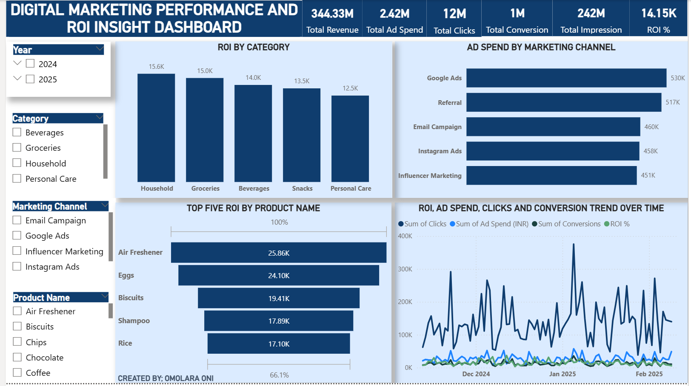
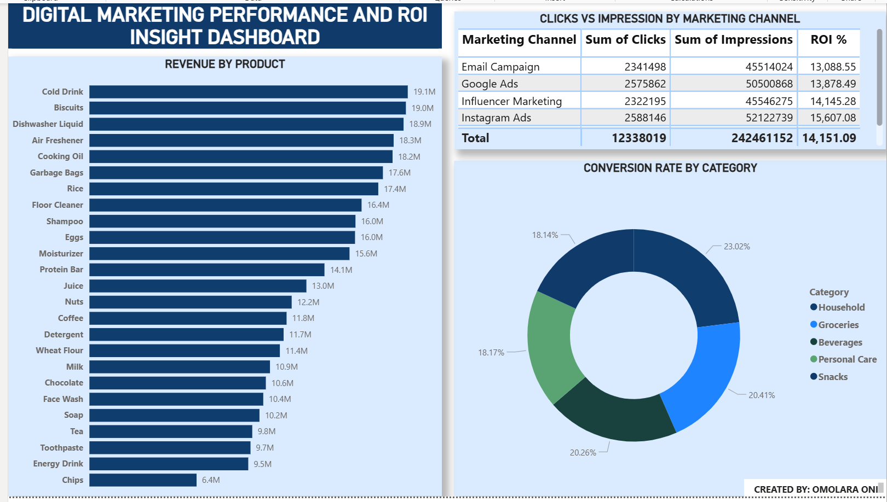

# 📊 Digital Marketing & ROI Insight Dashboard (Power BI)

## 📌 Project Overview

This project analyzes a **digital marketing campaign dataset** provided by **Axia Africa**.  
The dataset was **unclean**, with inconsistencies in text and data types. Using **Power BI**, I

* Cleaned and transformed the data
* Created **DAX measures** to calculate key metrics
* Built a **two-page interactive dashboard** to evaluate campaign performance, ROI, and trends

**Goal:** Provide actionable insights to optimize marketing spend and improve conversions.

---

## 🎯 Objectives

* Clean and organize messy marketing data using **Power Query**
* Calculate key metrics with **DAX measures**
* Build a clear, interactive **Power BI dashboard**
* Generate insights and **recommendations for marketing strategy**

---

## 🗂 Dataset Information

The dataset contains marketing campaign performance data including **products, categories, channels, spend, clicks, conversions, revenue, and ROI**.

---

## 🛠 Tools Used

* **Power BI**
  * **Power Query Editor** — Data Cleaning & Transformation  
  * **DAX** — Calculated Measures  
  * **Interactive Dashboard Visuals** — Charts, KPIs, Tables, Slicers

---

## 🔧 Data Cleaning & Preparation

* Corrected headers and standardized text fields  
* Checked for duplicates and missing values  
* Converted data types:
  * Text → Campaign ID, Product Name, Category, Marketing Channel  
  * Decimal → Ad Spend, Revenue, ROI  
  * Whole Number → Impressions, Clicks, Conversions  
  * Date → Campaign Date  
* Ensured formatting consistency before analysis  

---

## 📐 DAX Measures & Key Metrics

**Key Performance Indicators (KPIs):**

* Total Ad Spend  
* Total Revenue  
* Total Impressions  
* Total Clicks  
* Total Conversions  
* ROI  

**Calculated Metrics:**

* **Click Through Rate (CTR)** = Clicks ÷ Impressions  
* **Conversion Rate** = Conversions ÷ Clicks  
* **ROI (%)** = (Revenue – Ad Spend) ÷ Ad Spend  

> ✅ **DAX screenshot optional:** Recruiters can see your formulas explained here; no need to include an image unless you want to highlight complex measures.

---

## 📸 Dashboard Screenshots

  
*Full view of the Digital Marketing & ROI Insight Dashboard*

  
*Insights, trends, and ROI analysis*

---

## 🔍 Key Insights

### Overall Performance
* Total Revenue: **344.33M**  
* Total Ad Spend: **2.42M**  
* ROI: **14.15%**  
* Click Through Rate (CTR): **5.09%**  
* Conversion Rate: **9.81%**

### Top Categories & Products
* **Categories:** Household (Highest ROI & Conversion Rate), Groceries, Beverages  
* **Top Products:** Air Freshener, Eggs, Biscuits  
* **Underperforming Products:** Energy Drinks, Chips, Toothpaste  

### Marketing Channel Effectiveness
* Instagram Ads: 15.61% ROI  
* Referral: 14.09% ROI  
* Influencer Marketing: 14.15% ROI  

---

## 📈 Trend Analysis

* **Best ROI Day:** Dec 3, 2024 — high conversions & ROI  
* **Lowest ROI Day:** Nov 12, 2024 — poor conversion efficiency  
* **High spend, low return:** Jan 17, 2025 — potential wasted budget  

---

## ✅ Recommendations

* Increase spend on **Instagram, Referral, and Influencer campaigns**  
* Focus campaigns on **Household & Personal Care categories**  
* Optimize underperforming products and channels  
* Improve **ad creatives and landing pages** to raise conversion rate to **12–15%**  
* Replicate **Q4 seasonal campaigns** with high ROI  

---

## 📂 Access Project Files

* [Download Power BI Project](Digital_Marketing_ROI_Insight.pbix)  
* [Download Raw Dataset](marketing_campaign_data.xlsx)

---

## 🏁 Conclusion

This project demonstrates **Power BI skills** in cleaning, analyzing, and visualizing marketing data.  
It highlights **strong-performing categories, products, and channels**, and provides **actionable recommendations** to optimize marketing ROI and conversions.
This project demonstrates **Power BI skills** in cleaning, analyzing, and visualizing marketing data.  
It highlights **strong-performing categories, products, and channels**, and provides **actionable recommendations** to optimize marketing ROI and conversions.
